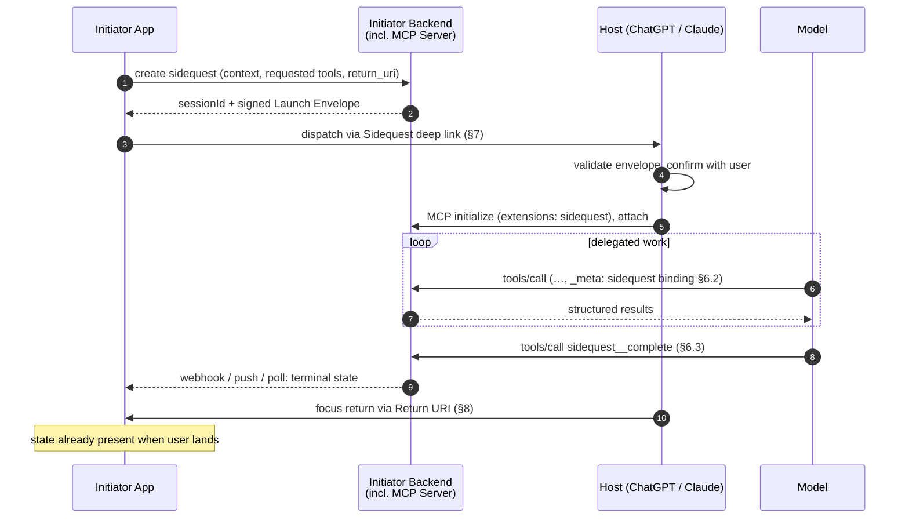

# SEP-XXXX: Sidequest — The App–Agent Continuation Protocol

| Field | Value |
|---|---|
| **Title** | Sidequest: Native App ⇄ Agent Work Continuation |
| **Track** | Extensions |
| **Extension ID** | `io.github.techna183.sidequest` (placeholder; final ID assigned at adoption) |
| **Status** | Draft / Pre-proposal (RFP) |
| **Author(s)** | David Berg \<techna1@gmail.com\> |
| **Created** | 2026-07-08 |
| **Requires** | MCP base protocol (rev 2025-06-18 or later); extension capability negotiation |

---

## 1. Abstract

**Sidequest** is an interoperable protocol by which an application (the
**Initiator**) dispatches a bounded unit of agentic work — a
*sidequest* — to the user's AI assistant of choice (the **Host**, e.g.
ChatGPT or Claude). The assistant performs the work against the
Initiator's backend via the Initiator's MCP server; on completion,
structured results flow back to the Initiator and user focus returns
to the app. The name is the model: **your app is the main quest.**

Mechanically, Sidequest specifies **`redirect_uri` semantics for
agentic work** — the analog of the OAuth 2.0 authorization code flow
or Android's `startActivityForResult`, applied to a delegated
conversational session. In one line: **MCP connects the assistant to
the application's capabilities; Sidequest connects the experience.**

The spec has two conformance profiles: **Profile A**, a normative MCP
extension (session binding, completion contract, abandonment
semantics — the parts the wire protocol can govern), and **Profile B**,
a companion host-integration profile (signed launch envelope, focus
return — host behaviors adopted voluntarily). It is proposed as an
Extensions-Track SEP: too opinionated for core, valuable as an
interoperable pattern.

## 2. Motivation

### 2.1 The false dichotomy

The industry is converging on two futures. In one, every app builds
its own copilot; in the other, every app is compressed into tools and
widgets inside an assistant. Both are strategically logical; neither
begins with the experience users want. The first gives every
application a lesser assistant, the second gives every assistant a
lesser application. Three structural asymmetries explain why both
fail, and Sidequest is designed around all three:

**The harness asymmetry.** A frontier assistant is a *harness* — the
agentic loop, tool orchestration, context management, memory,
multimodal streaming, safety, and accumulated default intelligence —
built with thousands of engineer-years and improved every model
generation. An app that hands off gets all of it for free, on someone
else's R&D budget; an app that embeds its own agent is racing
opponents whose core business is winning that race.

**The native ceiling.** What apps do best — first-class interfaces
built on direct manipulation, spatial layout, gesture, and instant
feedback (social feeds, games, creative tools, maps) — is
interface-shaped, not conversation-shaped. A widget in an iframe
inside someone else's conversation is a structurally lower ceiling
than a native app with full platform access.

**The relationship asymmetry.** An assistant's value is accumulated
understanding of one person, and it compounds only in one
relationship; per-app copilots fragment it, and the user reintroduces
themselves in every app. **The app knows the domain; the assistant
knows the person.** Sidequest lets both act on the same task, with the
assistant as the privacy boundary around personal context (§10.6).

Sidequest is the third path: stay native when native wins; when a
moment genuinely calls for an agentic experience, dispatch a sidequest
to the user's chosen assistant — signed context, scoped MCP access, a
return address — and get the structured result and the user back. For
assistant platforms the incentive is symmetric: every native app
becomes a source of high-intent sessions, and "the user's assistant
of choice" becomes a position worth competing for.

### 2.2 A user journey: choosing a couch

Couch shopping starts in a retail app because early shopping is
discovery — fabrics, dimensions, rejecting twenty couches in seconds.
When the shortlist narrows to three, the task becomes *judgment*:
spend $6,000 while cutting discretionary spending? That fabric, with
the dog? The app knows the couch; it knows none of this — and
shouldn't. Today the user bridges by hand: **copy-paste is the
unofficial interoperability layer between applications and personal
AI.** With Sidequest, the app offers "Ask my assistant": the user's
assistant opens with the shortlist, the retailer's MCP server supplies
product knowledge, the assistant supplies personal context, and the
decision returns to the app where checkout is waiting. This scenario
is the spec's running example (fictional retailer **Snug**).

### 2.3 What must exist

Today's pieces don't compose into continuation: `?q=` deep links are
unspecified, lossy, and unreliable on mobile; "terminal tool"
conventions have no schema and no abandonment signal; focus return has
no primitive at all. Three things must exist, and they structure this
spec:

1. **Standard invocation** of the user's chosen assistant across web,
   desktop, and mobile (§7).
2. **A handoff that carries more than a pasted prompt** — application
   state, intended outcome, and user-permissioned scoped capabilities
   via MCP (§5–6).
3. **Bidirectional continuation** — a structured result returned to
   the app, the user returned to where the task began, and related
   sidequests able to resume the same assistant thread (§6.3, §7.4,
   §8).

### 2.4 Prior art

| Prior art | What Sidequest borrows |
|---|---|
| **OAuth 2.0 authorization code flow** ([RFC 6749], [RFC 9700]) | Registered return URIs, correlation, open-redirect defenses, replay protection |
| **Android `ActivityResult` API** | Typed request/result contract between apps; cancellation as a first-class outcome |
| **OIDC `request` object (JWS)** ([OIDC Core §6]) | Signed request payload verifying the Initiator |
| **MCP SEP-414 (trace context)** | `_meta` as the pattern for threading correlation through tool calls |
| **App Links / Universal Links** | Platform-verified association between return URI and app |
| **Amazon Alexa "Send to Phone"** | Product precedent for cross-surface continuation preserving user intent |

### 2.5 Non-goals

- **Replacing direct API integration** — an app that wants a fully
  owned loop should call a model API directly; Sidequest targets work
  done inside the assistant's surface.
- **Gesture-free focus return** — platforms require a user gesture for
  most cross-app navigation; the spec works with that, not against it.
- **Agent-to-agent delegation** — out of scope for v1.

## 3. Terminology

**MUST**, **SHOULD**, **MAY**, etc. are per [RFC 2119]/[RFC 8174].

| Term | Definition |
|---|---|
| **Initiator** | The app that dispatches a sidequest and expects a result. |
| **Host** | The assistant application in which the sidequest runs; embeds the MCP client. |
| **Server** | The Initiator-controlled MCP server the Host connects to. |
| **Sidequest** | One delegated unit of agentic work, identified by `sessionId`, from dispatch to terminal state. |
| **Launch Envelope** | Signed payload the Initiator passes to the Host at dispatch (Profile B). |
| **Completion Record** | Structured terminal result delivered to the Server (Profile A). |
| **Terminal state** | One of `completed`, `partial`, `error`, `abandoned`, `expired`, `declined`. |

## 4. Architecture



The two-profile split follows from one observation: **the data path
back to the Initiator never depends on the Host exporting anything** —
the Server is the Initiator's own infrastructure and is in the loop
for every tool call. Only dispatch and focus return require Host
cooperation.

## 5. Capability Negotiation (Profile A)

Sidequest is negotiated as an MCP extension; both sides declare it in
`initialize`:

```json
{
  "capabilities": {
    "extensions": {
      "io.github.techna183.sidequest": {
        "version": "1.0",
        "roles": ["server"],
        "lifecycleNotifications": true
      }
    }
  }
}
```

A declaring Server **MUST** implement §6 in full. A declaring Client
**MUST** thread the §6.2 binding on every tool call in a sidequest and
**MUST** emit §6.4 notifications if negotiated. A Server **MUST** still
function with non-declaring clients via the degradation path (§9).

## 6. Profile A — MCP Extension (Normative)

### 6.1 Establishment

Sidequests are created by the Initiator's backend, which generates a
`sessionId` (opaque, ≥128 bits entropy, no encoded user data — a
bearer correlation token, secret until terminal) and an expiry
(`expires_at`; **RECOMMENDED** default 30 minutes, maximum 24 hours).

An extension-aware Host attaches after `initialize`:

```json
{
  "jsonrpc": "2.0",
  "id": 7,
  "method": "extensions/io.github.techna183.sidequest/attach",
  "params": { "sessionId": "sq_8f4b…", "envelopeSignature": "…" }
}
```

The Server **MUST** verify the sidequest exists, is unexpired, and is
not already attached (single-use; §10.3), then respond:

```json
{
  "result": {
    "sessionId": "sq_8f4b…",
    "expiresAt": "2026-07-08T05:00:00Z",
    "allowedTools": ["snug_get_shortlist", "snug_get_product", "snug_save_decision", "sidequest__complete"],
    "instructions": "Optional server guidance for the model, scoped to this sidequest."
  }
}
```

A legacy Host (§9) instead carries the `sessionId` in prompt text; the
Server marks the sidequest attached on first authenticated tool use.

### 6.2 Binding

Every tool call in a sidequest **MUST** carry the binding in `_meta`:

```json
{
  "method": "tools/call",
  "params": {
    "name": "snug_get_product",
    "arguments": { "productId": "couch-mira-3s" },
    "_meta": {
      "io.github.techna183.sidequest/session": { "sessionId": "sq_8f4b…", "seq": 4 }
    }
  }
}
```

`seq` (OPTIONAL) is a monotonic per-sidequest sequence number. Servers
**MUST** reject calls bound to expired or terminal sidequests (error
`-32011`, "sidequest not active") and **SHOULD** scope `tools/list` to
the sidequest's `allowedTools`.

### 6.3 Completion

The Server **MUST** expose a reserved completion tool with a fixed
name:

```json
{
  "name": "sidequest__complete",
  "description": "Complete the current sidequest and deliver results to the initiating application. Call exactly once, when the delegated task is finished or cannot proceed.",
  "inputSchema": {
    "type": "object",
    "required": ["sessionId", "status"],
    "properties": {
      "sessionId": { "type": "string" },
      "status": { "type": "string", "enum": ["completed", "partial", "error", "declined"] },
      "summary": { "type": "string", "description": "Human-readable summary of what was done." },
      "result": { "type": "object", "description": "Structured results per the Initiator-defined resultSchema." },
      "error": { "type": "object", "properties": { "code": { "type": "string" }, "message": { "type": "string" } } }
    }
  }
}
```

Model-assignable statuses: `completed` (task finished); `partial`
(some work concluded — distinct from `error` so Initiators can resume
rather than retry); `error` (failed; `error` field REQUIRED);
`declined` (model or user chose not to proceed). Two are
**Server-assigned only**: `expired` (lifetime passed) and `abandoned`
(client signaled teardown, or no bound tool call for a
**RECOMMENDED** 15 minutes). A sidequest reaches exactly one terminal
state and is then immutable; completing a terminal sidequest returns
error `-32012` ("sidequest already terminal").

The response to `sidequest__complete` **SHOULD** carry the
focus-return affordance (and **MAY** carry widget UI metadata):

```json
{
  "structuredContent": {
    "io.github.techna183.sidequest/return": {
      "returnUri": "https://app.snug.example/sidequest/return?session=sq_8f4b…",
      "label": "Return to Snug"
    }
  }
}
```

### 6.4 Lifecycle notifications

Clients that negotiated `lifecycleNotifications` **MUST** send
`extensions/io.github.techna183.sidequest/closed` with params
`{ "sessionId", "reason": "user_closed" | "host_shutdown" |
"user_cancelled" }` when the conversation is closed or torn down with
the sidequest non-terminal. This closes the silent-abandonment hole;
delivery is best-effort, which is why the §6.3 inactivity timeout
remains REQUIRED as backstop.

### 6.5 Result delivery

How the Initiator's backend relays the Completion Record to its own
app (webhook, push, polling) is out of scope — both ends are the same
party. The Server **MUST** persist the Completion Record and terminal
state until the Initiator retrieves it or it ages out per Initiator
policy. Because data return is server-side, **the Initiator can resume
work before the user physically returns.**

## 7. Profile B — Host Integration: Dispatch

### 7.1 Dispatch URL

Adopting Hosts **MUST** accept dispatch at:

```
https://<host>/sidequest/launch?envelope=<base64url(JWS)>
```

and **SHOULD** register a platform-native entry point (Android App
Link / iOS Universal Link) for the same path — fixing the biggest
failure of today's `?q=` links, silent parameter loss in mobile apps.

### 7.2 Launch Envelope

A JWS (compact serialization) signed by the Initiator:

```json
{
  "iss": "https://app.snug.example",
  "aud": "https://chatgpt.com",
  "iat": 1783822800,
  "exp": 1783824600,
  "jti": "sq_8f4b…",

  "sidequest": {
    "version": "1.0",
    "sessionId": "sq_8f4b…",
    "app": { "name": "Snug", "iconUri": "https://app.snug.example/icon.png" },
    "mcp": {
      "serverUrl": "https://mcp.snug.example/",
      "requestedTools": ["snug_get_shortlist", "snug_get_product", "snug_save_decision"]
    },
    "prompt": "Help me decide between the three couches on my shortlist.",
    "context": {
      "contentType": "application/json",
      "data": { "shortlist": ["couch-mira-3s", "couch-orla-l", "couch-pemb-3s"], "budgetCents": 600000 }
    },
    "resultSchema": { "$ref": "https://app.snug.example/schemas/decision-result.json" },
    "returnUri": "https://app.snug.example/sidequest/return",
    "resume": { "previousSessionId": "sq_11c0…" }
  }
}
```

- `iss` **MUST** publish signing keys (JWKS), registered `returnUri`
  prefixes, and MCP server URLs at
  `<iss>/.well-known/sidequest-initiator` — OAuth client registration,
  but discovery-based.
- Hosts **MUST** verify the signature against the `iss` JWKS, check
  `aud` and `exp`, and reject replayed `jti` values (§10.3).
- `context.data`: Hosts **MUST** accept ≤ 16 KiB and **MAY** reject
  larger — bigger context belongs behind the MCP server, not in a URL.
- `prompt` and `context` are attacker-influenceable text entering a
  model (§10.5). `resume` is OPTIONAL (§7.4).

### 7.3 Host behavior at dispatch

1. **MUST** require an authenticated user (completing login first,
   preserving the envelope).
2. **MUST** show a consent interstitial — verified origin (`iss`), app
   name, MCP server, requested tools, return URI — not skippable on
   first use of a given `iss`.
3. **MUST** connect to `mcp.serverUrl` (standard MCP authorization —
   Sidequest does not alter it), negotiate the extension, and attach
   (§6.1).
4. **MUST** present `prompt` + `context` to the model
   provenance-marked as third-party app content — not user-authored,
   not system-privileged.
5. On declined consent, **SHOULD** notify the Server (`closed`,
   `user_cancelled`) if reachable, else simply never attach — the
   sidequest expires.

### 7.4 Thread continuity: chained sidequests

Related sidequests should not start over — the earlier work's history
already lives in the Host's conversation thread. When an envelope
carries `resume.previousSessionId`, the Host **SHOULD** continue the
thread in which the referenced sidequest ran, provided it was
dispatched by the same `iss`, ran under the same authenticated user,
and still exists — and **MUST** start fresh otherwise. The Host
**MUST NOT** reveal to the Initiator whether resumption occurred
(thread existence is user-private; §10.6), **MUST** treat the new
`sessionId` as a distinct sidequest with its own attach, binding,
expiry, and terminal state (resumption is presentation; the state
machine never spans envelopes), and **MUST** disclose at consent that
an existing conversation will be continued.

## 8. Profile B — Host Integration: Focus Return

1. When the `sidequest__complete` response carries a `…/return`
   structure, the Host **MUST** render a prominent return affordance
   with the Initiator's name.
2. The Host **MUST** validate `returnUri` against the `iss`'s
   registered prefixes and require `https` or a platform-verified app
   link; custom schemes (`myapp://`) **MUST NOT** be accepted unless
   platform-attested.
3. The Host **MAY** auto-navigate without a gesture only when the
   platform permits it, the user previously enabled auto-return for
   this `iss`, and the terminal state is `completed`. Otherwise the
   return is a user tap.
4. The return navigation carries only `sessionId` and status — never
   result data (URLs leak; results travel server-side per §6.5):

   ```
   https://app.snug.example/sidequest/return?session=sq_8f4b…&status=completed
   ```

## 9. Graceful Degradation

Sidequest is adoptable incrementally; each rung down loses a property
but the flow still functions:

| Host support | Dispatch | Binding | Completion | Abandonment | Focus return |
|---|---|---|---|---|---|
| Profile A + B | Signed envelope | `_meta` | Reserved tool + notifications | `closed` + timeout | Validated affordance / auto-return |
| Profile A only | `?q=` with embedded `sessionId` | `_meta` | Reserved tool + notifications | Notifications + timeout | Model-emitted link |
| Neither (today) | `?q=` with embedded `sessionId` | `sessionId` as tool argument | Reserved tool by convention | Timeout only | Model-emitted link or widget button |

The same server serves every row — reserved tool name, result schema,
and terminal-state model are identical. The bottom row doubles as the
prototype required for SEP acceptance (§11).

## 10. Security & Privacy Considerations

### 10.1 Return-URI validation

The Host navigates to a third-party-supplied URI; all [RFC 9700]
lessons apply: exact-prefix matching against pre-registered values,
`https`/app-link only, no custom schemes without platform attestation.

### 10.2 Envelope integrity

Unsigned launch context (today's `?q=`) lets anyone impersonate an app
and preload a hostile prompt. The JWS + JWKS discovery gives the Host
a verifiable `iss`, which it **MUST** display at consent.

### 10.3 Replay protection

`jti`/`sessionId` are single-attach; replay after attach or expiry
**MUST** fail. Servers **MUST** treat `sessionId` as a bearer secret
until terminal (an active one can bind tool calls and forge a
completion) and **MAY** additionally bind the sidequest to the MCP
authorization identity established at connect.

### 10.4 Least privilege

`requestedTools` plus `allowedTools` scoping keep the sidequest
narrower than the Initiator's full MCP surface. Hosts **SHOULD**
surface the tool list at consent; Servers **MUST** enforce it
regardless.

### 10.5 Prompt injection

`prompt` and `context.data` are attacker-influenceable inputs to a
model holding live tool access. Hosts **MUST** provenance-mark them as
third-party data and **MUST NOT** let text content suppress consent,
alter the tool allowlist, or change the return URI — those live only
in the signed envelope. Servers likewise **MUST NOT** trust
`sidequest__complete` arguments beyond schema validity.

### 10.6 Privacy: the assistant as privacy boundary

The assistant may know far more about the user than any app should
see. Two permission models are possible, and they are fundamentally
different: the app gains access to the user's memory (wrong), or the
user permits their **assistant to apply** relevant personal context
(Sidequest's model). The assistant is the privacy boundary — it brings
personal understanding to bear without exporting the raw memories
behind it.

- The Host **MUST NOT** give the Initiator access to user memory,
  profile, or conversation history through any Sidequest mechanism.
- The app-visible surfaces are exactly tool-call arguments and the
  Completion Record. Hosts **MUST** treat everything written there as
  disclosure to the Initiator and **SHOULD** minimize: task-relevant
  conclusions ("over budget"), never the memories that produced them.
- Hosts **SHOULD** make the boundary transparent — what personal
  context is applied, what is disclosed.
- Thread continuity **MUST NOT** become a tracking channel (§7.4).
- Initiators **SHOULD** send references rather than raw sensitive
  data; result data **MUST NOT** appear in return URLs; `sessionId`
  **MUST NOT** encode user identifiers.

Continuation without boundaries becomes surveillance; with the right
boundaries, the assistant carries its understanding of the user across
every application without any application ever holding it.

## 11. Compatibility & Reference Implementation

Sidequest is a negotiated extension: non-participants are unaffected,
and it versions independently of the MCP spec. The reserved tool name
and `_meta` key are namespaced. If adoption warrants, §6 is the
candidate for graduation into core; §7–8 remain a host-platform
companion by nature.

SEP acceptance requires a working prototype: a minimal Initiator app
(web + one mobile platform), a reference MCP server implementing §6 in
full plus the §9 bottom row against today's ChatGPT and Claude, a
simulated Host demonstrating Profile A/B, and a conformance checklist
per role.

## 12. Open Questions

1. **Pause/resume of a single sidequest** — chains resume threads
   (§7.4), but should an individual sidequest survive a long gap, or
   is expire-and-chain the right answer? v1: the latter.
2. **Disclosure transparency** — should a user-reviewable "what was
   shared" record per sidequest be standardized, or is that Host UX?
3. **Envelope ceiling** — is 16 KiB right, and should a `contextUri`
   variant be normative?
4. **Consent fatigue** — where is the OAuth "trusted app" line for
   remembered per-`iss` consent?
5. **Extension ID and name** — final reverse-DNS ID pending sponsor /
   Agents WG input; assess trademark posture of "Sidequest" (VR
   app-store brand exists in an adjacent market) before public launch.

## 13. References

- [RFC 6749] The OAuth 2.0 Authorization Framework
- [RFC 9700] Best Current Practice for OAuth 2.0 Security
- [RFC 2119] / [RFC 8174] Key words for use in RFCs
- [OIDC Core §6] — Passing Request Parameters as JWTs
- MCP Specification — capability negotiation, `_meta`, tools
- MCP SEP Guidelines — https://modelcontextprotocol.io/community/sep-guidelines
- OpenAI Apps SDK — MCP-based apps in ChatGPT (host UI precedent)

[RFC 6749]: https://www.rfc-editor.org/rfc/rfc6749
[RFC 9700]: https://www.rfc-editor.org/rfc/rfc9700
[RFC 2119]: https://www.rfc-editor.org/rfc/rfc2119
[RFC 8174]: https://www.rfc-editor.org/rfc/rfc8174
[OIDC Core §6]: https://openid.net/specs/openid-connect-core-1_0.html#JWTRequests
