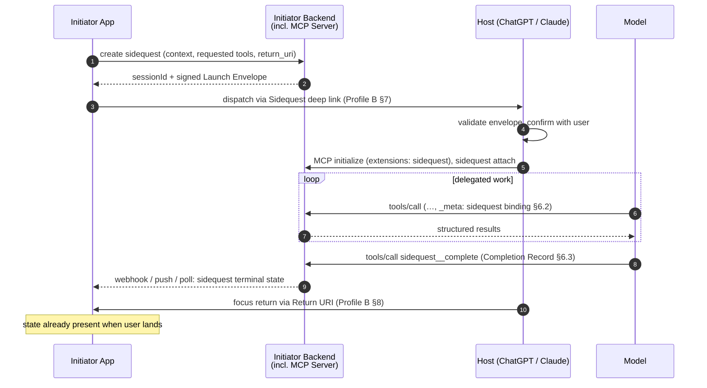

# SEP-XXXX: Sidequest — The App–Agent Continuation Protocol

| Field | Value |
|---|---|
| **Title** | Sidequest: Native App ⇄ Agent Work Continuation |
| **Track** | Extensions |
| **Extension ID** | `io.github.techna183.sidequest` (placeholder; final reverse-DNS ID assigned at adoption) |
| **Status** | Draft / Pre-proposal (RFP) |
| **Author(s)** | techna183 |
| **Created** | 2026-07-08 |
| **Requires** | MCP base protocol (rev 2025-06-18 or later); extension capability negotiation |
| **Replaces** | — |

---

## 1. Abstract

**Sidequest** is a first-class, interoperable protocol by which a
native or web application (the **Initiator**) dispatches a bounded unit
of agentic work — a *sidequest* — to the user's AI agent of choice (the
**Host** — e.g. ChatGPT, Claude, or any MCP-capable agent surface). The
agent performs that work against the Initiator's backend via the
Initiator's MCP server, and — on completion — structured results flow
back to the Initiator and user focus returns to the app.

The name is the model: **your app is the main quest.** An agentic
conversation is a sidequest — dispatched with context, completed with
your app's tools, and returned from. Mechanically, Sidequest specifies
**`redirect_uri` semantics for agentic work**: the analog of the OAuth
2.0 authorization code flow ([RFC 6749]) or Android's
`startActivityForResult`, applied to a delegated conversational work
session instead of an authorization grant.

The relationship to MCP in one line: **MCP connects the assistant to
the application's capabilities; Sidequest connects the experience.**
MCP governs what the agent can do against the app's backend. Sidequest
governs how the *task* moves — carrying intent, context, permissions,
conversation, and completed work across the app/assistant boundary,
in both directions, without the user reconstructing it at every edge.

The specification is split into two conformance profiles, reflecting a
deliberate boundary:

1. **Profile A — MCP Extension (normative for MCP participants):**
   sidequest binding of tool calls via `_meta`, a completion contract
   (terminal result schema + lifecycle notifications), and timeout /
   abandonment semantics. These are things the MCP wire protocol can
   actually govern.
2. **Profile B — Host Integration Profile (companion; adopted
   voluntarily by Hosts):** a standard launch envelope (deep-link /
   URL format) for dispatching a sidequest with signed context, and
   host behavior for returning focus to the Initiator on completion.
   These are host *application* behaviors that sit outside the MCP
   client↔server wire format but are required for the end-to-end flow.

---

## 2. Motivation

### 2.1 Strategic positioning: the false dichotomy

App developers are currently offered two futures, and both are wrong:

**Option 1 — move the workflow into the agent surface.** Rebuild your
product as tools behind someone else's chat box. You lose everything a
rich native experience is *for*: direct manipulation, purpose-built
visualization, offline and low-latency interaction, platform
integration, accessibility investment, and your own brand and surface.
Chat is a poor primary interface for most of what apps do well.

**Option 2 — build the agent into your app.** Embedding an excellent
agentic chat experience natively is a very heavy lift: inference costs,
agentic-loop engineering, streaming conversational UI, tool
orchestration, memory, multimodality, and safety — all rebuilt, per
app, to a quality bar set by frontier assistants. The market outcome of
this path is a thousand mediocre in-app chatbots, while the user
already has an agent they chose, trust, and pay for.

Neither future begins with the experience users actually want. The
first gives every application a lesser assistant; the second gives
every assistant a lesser application. Underneath the dichotomy are
three structural asymmetries, and Sidequest is designed around taking
all of them seriously rather than fighting any of them.

#### The harness asymmetry: agent harnesses are brutally hard to build

A frontier agent surface is not a chat UI with an API key behind it.
It is a *harness*: the agentic loop and its recovery behaviors, tool
selection and orchestration across many servers, context management
over long sessions, streaming multimodal rendering, memory and
personalization, safety and abuse systems, evaluation infrastructure,
and — critically — the accumulated default behaviors and judgment that
make a frontier model actually useful in open-ended conversation.
Frontier AI companies pour thousands of engineer-years into this
layer, improve it with every model generation, and amortize the cost
across hundreds of millions of users.

An app developer who hands off to that harness gets all of it **for
free, forever, on someone else's R&D budget** — including improvements
that haven't shipped yet. An app developer who embeds their own agent
is signing up to compete with it: a depreciating asset in a race
against opponents whose core business is winning that race. For the
overwhelming majority of app builders, that is not a resource-rational
fight. The rational move is to *use* the frontier harness for the
chat-based, AI-forward moments of a workflow — which is exactly the
dispatch half of Sidequest.

#### The native ceiling: agent surfaces will not replace first-class UX

The symmetric asymmetry runs the other way. What app developers do
best — beautiful, native, first-class interfaces — is not something a
conversational surface is on a path to replace. Social feeds, video
games, mapping, creative tools, camera experiences, anything built on
direct manipulation, spatial layout, gesture, motion, or sub-100ms
feedback loops: these are irreducibly interface-shaped, not
conversation-shaped. Agent surfaces will get richer at hosting app
content — embedded widgets in an iframe inside a chat thread already
exist — but a widget inside someone else's conversation is a
fundamentally lower ceiling than a first-class native app with full
platform access, and the strongest UX categories live far above that
ceiling. The agent platforms' own app frameworks implicitly concede
this: they render *fragments* of apps, on the agent's terms, inside
the agent's chrome.

So neither side should swallow the other — and neither side can.

#### The relationship asymmetry: understanding compounds in one assistant

The third asymmetry belongs to the user. A personal assistant's value
comes from accumulated understanding — finances, household, health
considerations, habits, history, taste — and that understanding
compounds only if it lives in *one* relationship. The per-app-copilot
future fragments it: each in-app assistant understands a narrow
office, none understands the whole person, and the user reintroduces
themselves in every application they open. Nobody organizes their real
life this way; a person with an exceptional assistant wants that
assistant across many contexts, growing more valuable as the
relationship deepens.

No application can replicate this, and no application should try: the
personal context rightly belongs to the assistant the user chose and
trusts (see §10.6 — the assistant is also the *privacy boundary*
around that context). A one-off in-app shopping assistant may know the
inventory; it will never know the user. **The app knows the domain.
The assistant knows the person.** Sidequest is the mechanism that lets
both kinds of knowledge act on the same task without either side
surrendering its half.

**Sidequest is the third path.** The user stays in your app when native
is the right modality. When a moment genuinely calls for an agentic
chat experience, your app dispatches a *sidequest* to the **user's
assistant of choice** — carrying signed context, scoped access to your
MCP server, and a return address. The assistant does the work with your
tools and its accumulated understanding of the user, your backend
receives the structured result, and the user comes back to your app
with the work done. Each side operates where it holds a structural
advantage the other cannot buy: the app keeps the interface it can
build and the agent cannot, and borrows the harness — and the
relationship — it cannot build and the agent already has.

For agent platforms, the incentive is symmetric: Sidequest makes every
native app a source of high-intent, context-rich sessions, and being
"the user's assistant of choice" becomes a destination worth competing
for. Sidequest does not weaken frontier assistants — it makes them more
indispensable: the assistant does not need to replace every product
interface to become the trusted intelligence that accompanies the user
across all of them.

### 2.2 A user journey: choosing a couch

The task-shape argument in one concrete story. A user shopping for a
couch begins inside a retail app, because early shopping is discovery:
inspecting fabrics, comparing dimensions, saving favorites, rejecting
twenty couches in seconds without explaining why. This phase is
irreducibly native — visual, comparative, fast.

Then the shortlist narrows to three, and the task changes nature. It
becomes *judgment*: should they spend $6,000 while trying to reduce
discretionary spending? Is that fabric a mistake given the dog, or the
allergies? Are they choosing the fashionable option when they
consistently prefer comfort and durability? The retail app knows the
couch; it knows none of this about the person — and shouldn't.

Today the user bridges the gap by hand: copying links, taking
screenshots, reconstructing the session inside ChatGPT or Claude. With
Sidequest, the app offers **"Ask my assistant."** The user's chosen
assistant opens with the shortlist and whatever context the user
elected to share; the retailer's MCP server supplies product knowledge;
the assistant supplies personal context and frontier intelligence. When
the decision is made, the structured result returns to the retail app,
where configuration, delivery, and checkout are waiting — the surfaces
trade the task back and forth as its nature changes, and neither
pretends to be the other.

This scenario is used as the spec's running example (the fictional
retailer **Snug**, `app.snug.example`).

### 2.3 The mechanical problem

The state of the art for moving a task from an application into a
personal assistant is **copy and paste**. Users copy text or take a
screenshot, paste it into the assistant they already trust, explain
what they were doing, and continue there. Copy-paste has become the
unofficial interoperability layer between applications and personal
AI: crude, lossy, and manual — but predictable, which is more than can
be said for the lottery of another half-built in-app assistant with no
memory of the user. Sidequest exists to replace that layer with a
specified one.

An application that wants to do better today — have the agent perform
work on the user's behalf *inside the agent's own UI* — has only
ad-hoc pieces:

- **Handoff in** is limited to unspecified, lossy, host-specific query
  parameters (`https://chatgpt.com/?q=...`,
  `https://claude.ai/new?q=...`). These carry only free text, have no
  integrity protection, no session correlation, no capability request,
  and behave inconsistently — particularly in mobile apps, where the
  parameter is frequently dropped.
- **Data return** can be improvised: since the Host talks to the
  Initiator's MCP server, developers define an unofficial "terminal
  tool" (e.g. `finalize_session(session_id, results)`) and instruct
  the model to call it. This works but is pure convention — no schema,
  no distinction between success, partial completion, abandonment, or
  error, and no way for the Initiator's server to learn that a user
  silently closed the tab.
- **Focus return** has no primitive at all. The best available today
  is a widget button or a link the model emits, both host-specific.

The result: every app/agent pair reinvents a fragile,
non-interoperable version of the same flow. There is no equivalent of
the well-understood OAuth round trip — *hand off → do work → return
with result* — for agentic sessions.

Three things must therefore exist, and they structure this spec:

1. **Standard invocation of the user's chosen assistant** across web,
   desktop, and mobile — the dispatch envelope and endpoint (§7).
2. **A handoff that carries more than a pasted prompt** — application
   state, intended outcome, supporting context, and user-permissioned,
   scoped capabilities via MCP (§5–6, §7.2).
3. **A handoff that works in both directions** — a structured result
   returned to the application, the user brought back to where the
   task began (§6.3, §8), and related sidequests able to resume the
   same assistant thread instead of starting over (§7.4).

A primitive version can be prototyped with today's `?q=` deep links
(§9), but its limits appear immediately: context crammed into a
prompt, no reliable resumption, no clean structured return. MCP alone
does not close the gap either — it lets the assistant write to the
application's backend, but does not complete the *user-facing*
continuation.

### 2.4 Prior art

| Prior art | What Sidequest borrows |
|---|---|
| **OAuth 2.0 authorization code flow** ([RFC 6749], [RFC 9700]) | Registered return URIs, `state` correlation, open-redirect defenses, replay protection |
| **Android `startActivityForResult` / `ActivityResult` API** | Typed request/result contract between two apps, cancellation as a first-class outcome |
| **OpenID Connect `request` object (JWS)** ([OIDC Core §6]) | Signed request payload so the receiving party can verify the Initiator |
| **MCP SEP-414 (trace context via `_meta`)** | Established pattern for threading cross-cutting correlation data through tool calls in `_meta` |
| **W3C Web Share Target / App Links / Universal Links** | Platform-verified association between a return URI and the Initiating app |
| **Amazon Alexa "Send to Phone"** | Product precedent for cross-surface continuation: begin a task on the surface suited to one phase (voice), continue on the surface suited to the next (visual/mobile), preserving user intent across the boundary |

### 2.5 Why an Extensions-Track SEP

Sidequest is too opinionated for MCP core: it prescribes an
application-level workflow, not a transport or message primitive. The
Extensions Track exists precisely for interoperable patterns that
version independently, are negotiated through the client/server
`capabilities.extensions` map, and can graduate toward core if adoption
demonstrates demand. Agent workflows and the apps ecosystem are within
the project's stated priority areas; Sidequest is positioned as
*interop for agentic app-to-agent workflows*.

### 2.6 Non-goals

- **Replacing direct API integration.** If an application wants a fully
  owned loop, calling a model API directly with the same tools remains
  the right architecture. Sidequest targets the case where the user
  should work *inside* the agent's surface (its UI, subscription,
  memory, and multimodal capabilities).
- **Automatic, gesture-free focus return.** Browsers and mobile
  operating systems require a user gesture for most cross-app
  navigation. Sidequest specifies how the Host must *surface* the
  return affordance and when it MAY auto-redirect; it does not pretend
  the platform constraints away.
- **Agent-to-agent delegation.** Out of scope for v1.

---

## 3. Terminology

The key words **MUST**, **MUST NOT**, **REQUIRED**, **SHALL**, **SHALL
NOT**, **SHOULD**, **SHOULD NOT**, **RECOMMENDED**, **MAY**, and
**OPTIONAL** are to be interpreted as described in [RFC 2119] /
[RFC 8174].

| Term | Definition |
|---|---|
| **Initiator** | The application (native, web, or backend) that dispatches a sidequest and expects a result. The user's "main quest." |
| **Host** | The agent application (e.g. ChatGPT, Claude) in which the user performs the sidequest. The Host embeds the **MCP Client**. |
| **Server** | The Initiator-controlled MCP server the Host connects to during the sidequest. The Initiator and Server are operated by the same party (or a trust relationship exists between them). |
| **Sidequest** | A single delegated unit of agentic work, identified by a `sessionId`, from dispatch to a terminal state. |
| **Launch Envelope** | The signed, structured payload the Initiator passes to the Host at dispatch (Profile B). |
| **Completion Record** | The structured terminal result delivered to the Server (Profile A). |
| **Return URI** | The pre-registered URI at which the Initiator regains focus (Profile B). |
| **Terminal state** | One of `completed`, `partial`, `error`, `abandoned`, `expired`, `declined`. |

---

## 4. Architecture Overview



Key architectural observation (from which the two-profile split
follows): **the data path back to the Initiator never depends on the
Host exporting anything.** Because the Server is the Initiator's own
infrastructure and is in the loop for every tool call, the "result
callback" is simply a specified, reserved tool invocation plus
lifecycle notifications. Only the *dispatch* and the *focus return*
require Host cooperation.

---

## 5. Capability Negotiation (Profile A)

Sidequest is negotiated as an MCP extension. Servers declare support in
`initialize`:

```json
{
  "capabilities": {
    "extensions": {
      "io.github.techna183.sidequest": {
        "version": "1.0",
        "roles": ["server"],
        "lifecycleNotifications": true
      }
    }
  }
}
```

Clients (Hosts) that implement Profile A declare the same extension key
in their client capabilities.

- A Server that declares Sidequest **MUST** implement §6 in full.
- A Client that declares Sidequest **MUST** thread sidequest binding
  metadata (§6.2) on every tool call within a sidequest and **MUST**
  emit lifecycle notifications (§6.4) if `lifecycleNotifications` was
  negotiated.
- If the client does **not** declare Sidequest, the Server **MUST**
  still function (graceful degradation, §9): sidequest binding falls
  back to prompt-carried tokens and lifecycle notifications are
  unavailable.

---

## 6. Profile A — MCP Extension (Normative)

### 6.1 Sidequest establishment

A Sidequest is created **by the Initiator's backend**, not by the Host.
The backend generates:

- `sessionId` — an opaque identifier with at least 128 bits of
  entropy. It **MUST NOT** encode user data. It functions as a
  bearer correlation token and **MUST** be treated as a secret until
  the sidequest reaches a terminal state.
- an expiry (`expires_at`) — sidequests **MUST** have a bounded
  lifetime; **RECOMMENDED** default 30 minutes, maximum 24 hours.

The Server learns that a Host has picked up the sidequest in one of two
ways:

1. **Extension-aware Host:** the client sends an `attach` request
   after `initialize`:

   ```json
   {
     "jsonrpc": "2.0",
     "id": 7,
     "method": "extensions/io.github.techna183.sidequest/attach",
     "params": {
       "sessionId": "sq_8f4b…",
       "envelopeSignature": "…"
     }
   }
   ```

   The Server **MUST** verify the `sessionId` exists, is unexpired,
   and has not already been attached (single-use attach; see replay
   protection, §10.3). On success it responds with the sidequest's
   working parameters:

   ```json
   {
     "result": {
       "sessionId": "sq_8f4b…",
       "expiresAt": "2026-07-08T05:00:00Z",
       "allowedTools": ["snug_get_shortlist", "snug_get_product", "snug_save_decision", "sidequest__complete"],
       "instructions": "Optional server guidance for the model, scoped to this sidequest."
     }
   }
   ```

2. **Legacy Host (degradation path, §9):** the `sessionId` arrives
   inside the prompt text and reaches the Server as an argument on the
   first tool call. The Server marks the sidequest attached on first
   authenticated use.

### 6.2 Sidequest binding of tool calls

Every tool call the client makes within a sidequest **MUST** carry the
binding in `_meta`, following the established `_meta` propagation
pattern:

```json
{
  "method": "tools/call",
  "params": {
    "name": "snug_get_product",
    "arguments": { "productId": "couch-mira-3s" },
    "_meta": {
      "io.github.techna183.sidequest/session": {
        "sessionId": "sq_8f4b…",
        "seq": 4
      }
    }
  }
}
```

- `sessionId` (REQUIRED) — the attached sidequest.
- `seq` (OPTIONAL) — monotonically increasing per-sidequest sequence
  number, enabling the Server to detect gaps and ordering.

Servers **MUST** reject tool calls bound to expired or terminal
sidequests with a JSON-RPC error (code `-32011`, "sidequest not
active"), and **SHOULD** scope tool availability (via `tools/list`
filtering) to the sidequest's `allowedTools`.

### 6.3 Completion contract

The Server **MUST** expose a reserved completion tool. Its name is
fixed so Hosts and models can recognize it generically:

**Tool: `sidequest__complete`**

```json
{
  "name": "sidequest__complete",
  "description": "Complete the current sidequest and deliver results to the initiating application. Call exactly once, when the delegated task is finished or cannot proceed.",
  "inputSchema": {
    "type": "object",
    "required": ["sessionId", "status"],
    "properties": {
      "sessionId": { "type": "string" },
      "status": {
        "type": "string",
        "enum": ["completed", "partial", "error", "declined"]
      },
      "summary": {
        "type": "string",
        "description": "Human-readable summary of what was done."
      },
      "result": {
        "type": "object",
        "description": "Structured results. Schema is Initiator-defined and advertised per sidequest (resultSchema in the Launch Envelope)."
      },
      "error": {
        "type": "object",
        "properties": {
          "code": { "type": "string" },
          "message": { "type": "string" }
        }
      }
    }
  }
}
```

Semantics:

- `completed` — the delegated task finished as requested.
- `partial` — some work concluded; `result` contains what exists and
  `summary` explains the gap. Distinct from `error` so Initiators can
  resume rather than retry.
- `error` — the task failed; `error` is REQUIRED.
- `declined` — the model or user chose not to perform the task (e.g.
  policy refusal, user said "never mind"). No result expected.

The Server's response to `sidequest__complete` **SHOULD** include the
focus-return affordance so extension-aware Hosts can render it (§8),
and — for Hosts supporting embedded UI (e.g. Apps-SDK-style widgets) —
**MAY** include UI metadata rendering a "Return to *App*" control:

```json
{
  "content": [
    { "type": "text", "text": "Sidequest complete. The user can return to Snug." }
  ],
  "structuredContent": {
    "io.github.techna183.sidequest/return": {
      "returnUri": "https://app.snug.example/sidequest/return?session=sq_8f4b…",
      "label": "Return to Snug"
    }
  }
}
```

Two abandonment-adjacent terminal states are **Server-assigned**, never
model-assigned:

- `expired` — `expires_at` passed without completion.
- `abandoned` — the client signaled sidequest teardown (§6.4) or the
  Server observed prolonged inactivity (**RECOMMENDED** inactivity
  threshold: 15 minutes without a bound tool call) with no completion.

A sidequest **MUST** reach exactly one terminal state, after which it
is immutable. `sidequest__complete` on an already-terminal sidequest
**MUST** return error `-32012` ("sidequest already terminal").

### 6.4 Lifecycle notifications (extension-aware Hosts)

Clients that negotiated `lifecycleNotifications` **MUST** send:

| Notification | When |
|---|---|
| `extensions/io.github.techna183.sidequest/closed` | The user closed the conversation/tab, or the Host is tearing down the connection with the sidequest non-terminal. Params: `{ "sessionId", "reason": "user_closed" \| "host_shutdown" \| "user_cancelled" }` |

This fixes the silent-abandonment hole: today a Server cannot
distinguish "user is thinking" from "user closed the tab" except by
timeout. Best-effort delivery is acknowledged — Hosts crash — which is
why the inactivity timeout in §6.3 remains REQUIRED as backstop.

### 6.5 Result delivery to the Initiator

How the Initiator's backend relays the Completion Record to the
Initiator app (webhook, push notification, polling on `sessionId`,
server-sent events) is **out of scope** — both ends are operated by the
same party. The spec's requirement is only:

- The Server **MUST** persist the Completion Record and terminal state
  at least until the Initiator acknowledges retrieval or the record
  ages out per the Initiator's policy.

This enables the signature UX of Sidequest: **the Initiator can resume
work before the user physically returns**, because data return
(server-side) precedes focus return (user gesture).

---

## 7. Profile B — Host Integration: Dispatch (Companion, Normative for Adopting Hosts)

### 7.1 Dispatch URL

Hosts adopting Profile B **MUST** accept a Sidequest dispatch at a
documented endpoint:

```
https://<host>/sidequest/launch?envelope=<base64url(JWS)>
```

and **SHOULD** also register a platform-native entry point (Android
App Link / iOS Universal Link to the same path) so native Initiators
get in-app handoff rather than a browser bounce. This addresses the
single most-reported failure of today's `?q=` mechanism: silent
parameter loss in mobile apps.

### 7.2 Launch Envelope

The envelope is a **JWS (compact serialization)** signed by the
Initiator. Payload claims:

```json
{
  "iss": "https://app.snug.example",
  "aud": "https://chatgpt.com",
  "iat": 1783822800,
  "exp": 1783824600,
  "jti": "sq_8f4b…",

  "sidequest": {
    "version": "1.0",
    "sessionId": "sq_8f4b…",
    "app": {
      "name": "Snug",
      "iconUri": "https://app.snug.example/icon.png"
    },
    "mcp": {
      "serverUrl": "https://mcp.snug.example/",
      "requestedTools": ["snug_get_shortlist", "snug_get_product", "snug_save_decision"]
    },
    "prompt": "Help me decide between the three couches on my shortlist.",
    "context": {
      "contentType": "application/json",
      "data": { "shortlist": ["couch-mira-3s", "couch-orla-l", "couch-pemb-3s"], "budgetCents": 600000 }
    },
    "resultSchema": { "$ref": "https://app.snug.example/schemas/decision-result.json" },
    "returnUri": "https://app.snug.example/sidequest/return",
    "resume": {
      "previousSessionId": "sq_11c0…"
    }
  }
}
```

Requirements:

- `iss` **MUST** be an origin at which the Initiator publishes its
  signing keys via JWKS at
  `<iss>/.well-known/sidequest-initiator` (which also lists registered
  `returnUri` prefixes and MCP server URLs — the OAuth client-
  registration analog, but discovery-based rather than requiring a
  pre-existing Host↔Initiator relationship).
- Hosts **MUST** verify the signature against the `iss` JWKS, check
  `aud`, `exp`, and reject replayed `jti` values (§10.3).
- `context.data` is size-bounded: Hosts **MUST** accept ≤ 16 KiB and
  **MAY** reject larger. Larger context belongs behind the MCP server
  (fetched by tools), not in the URL.
- `prompt` and `context` are **attacker-influenceable text entering a
  model** and are subject to §10.5.
- `resume` (OPTIONAL) references an earlier sidequest from the same
  `iss` whose conversation thread this sidequest continues; semantics
  in §7.4.

### 7.3 Host behavior at dispatch

On receiving a valid envelope, the Host:

1. **MUST** require an authenticated user (or complete login first,
   preserving the envelope).
2. **MUST** display a consent interstitial before starting the
   sidequest, showing: the Initiator's verified origin (`iss`), app
   name, the MCP server it will connect to, the requested tools, and
   the return URI. This is the OAuth consent-screen analog and
   **MUST NOT** be skippable on first use of a given `iss`.
3. **MUST** connect to `mcp.serverUrl` (completing MCP authorization
   as normal — Sidequest does not alter MCP auth), negotiate the
   Sidequest extension, and send `attach` (§6.1).
4. **MUST** start the conversation with `prompt` + `context`
   presented to the model, clearly provenance-marked as
   third-party-app-provided content (not user-authored, not
   system-privileged).
5. If the user declines consent, the Host **SHOULD** notify the
   Server (`closed`, reason `user_cancelled`) if reachable without
   auth friction, else simply not attach — the sidequest then expires
   (§6.3).

### 7.4 Thread continuity: chained sidequests

Related sidequests should not start over. When work naturally spans
several handoffs — the couch decision today, the matching armchair
next month — the history of the earlier work is part of the context of
the later work, and it already lives in the Host's conversation
thread. The `resume` field lets an Initiator ask for that continuity.

When an envelope carries `resume.previousSessionId`, the Host:

1. **SHOULD** continue the conversation thread in which the referenced
   sidequest ran, rather than opening a fresh conversation — provided
   *all* of the following hold: the referenced sidequest was dispatched
   by the **same `iss`**, it ran under the **same authenticated Host
   user**, and its thread still exists on this Host.
2. **MUST** start a fresh conversation when any condition fails, and
   **MUST NOT** reveal to the Initiator whether resumption occurred
   beyond the fact of attachment (thread existence is user-private
   information; see §10.6).
3. **MUST** still treat the new `sessionId` as a distinct sidequest:
   its own attach, binding, expiry, and terminal state (§6). Resumption
   is a *presentation* behavior — the protocol state machine never
   spans envelopes.
4. **MUST** show at consent that the dispatch will continue an
   existing conversation.

Each sidequest in a chain reaches its own terminal state; the chain
itself has no protocol-level state. Initiators correlate chained
sidequests server-side via their own records of
`previousSessionId` — nothing new crosses the wire.

---

## 8. Profile B — Host Integration: Focus Return

1. When the Server's `sidequest__complete` response (or the widget
   it returns) carries a `…/return` structure, the Host **MUST**
   render a prominent return affordance (button/banner) with the
   Initiator's name.
2. The Host **MUST** validate `returnUri` against the `iss`'s
   registered `returnUri` prefixes from its well-known document
   **and** require it to be `https` or a platform-verified app link.
   Custom schemes (`myapp://`) **MUST NOT** be accepted unless
   platform-attested — this is the open-redirect lesson from OAuth
   applied directly.
3. The Host **MAY** auto-navigate to the return URI without a user
   gesture only when *all* of: the platform permits it, the user has
   previously enabled auto-return for this `iss`, and the sidequest
   terminal state is `completed`. In all other cases the return is a
   user tap. The spec deliberately acknowledges the platform gesture
   requirement rather than fighting it.
4. The return navigation carries only `sessionId` and terminal
   status — never result data:

   ```
   https://app.snug.example/sidequest/return?session=sq_8f4b…&status=completed
   ```

   Results travel server-side (§6.5). URLs leak (history, logs,
   referrers); result payloads in return URLs are prohibited
   (**MUST NOT**).

---

## 9. Graceful Degradation / Polyfill Path

Sidequest is adoptable incrementally. Each rung down loses a property
but the flow still functions:

| Host support | Dispatch | Sidequest binding | Completion | Abandonment signal | Focus return |
|---|---|---|---|---|---|
| Full Profile A + B | Signed envelope | `_meta` | Reserved tool + notifications | `closed` + timeout | Validated affordance / auto-return |
| Profile A only | `?q=` with embedded `sessionId` | `_meta` | Reserved tool + notifications | notifications + timeout | Model-emitted link |
| Neither (today's ChatGPT/Claude) | `?q=` with embedded `sessionId` | `sessionId` as tool argument, per server instructions | Reserved tool by convention | Timeout only | Model-emitted link or widget `openExternal` button |

Serving the bottom row today with the same server that will serve the
top row later is an explicit design goal: the reserved tool name,
result schema, and terminal-state model are identical across rows.
This also defines the **prototype implementation** required for SEP
acceptance (§12).

---

## 10. Security Considerations

### 10.1 Return-URI validation (open redirect)

The Host renders and navigates to a URI whose ultimate source is a
third party. All lessons of [RFC 9700] apply: exact-prefix matching
against the `iss`'s pre-registered list, `https`/app-link only, no
custom schemes without platform attestation, no user-controlled
components in the validated prefix. A Host that skips this becomes a
phishing trampoline with an AI agent's credibility attached.

### 10.2 Envelope integrity and Initiator authentication

Unsigned launch context (today's `?q=`) lets anyone craft a link that
impersonates an app and preloads a hostile prompt. The JWS envelope +
JWKS discovery gives the Host a verifiable `iss`. Hosts **MUST**
display the verified origin — not the self-declared app name alone —
at consent.

### 10.3 Replay protection

`jti`/`sessionId` are single-attach (§6.1). A replayed envelope after
attach **MUST** fail; a replayed envelope after expiry **MUST** fail on
`exp`. Servers **MUST** treat `sessionId` as a bearer secret until
terminal: anyone holding an active `sessionId` can bind tool calls to
the sidequest and forge a completion. For higher-assurance deployments,
Servers **MAY** additionally bind the sidequest to the MCP
authorization identity established at connect time and reject bound
calls from other identities.

### 10.4 Least privilege

`requestedTools` + the Server's `allowedTools` scoping (§6.2) keep the
sidequest narrower than the Initiator's full MCP surface. Hosts
**SHOULD** surface the tool list at consent; Servers **MUST** enforce
it regardless of what the Host displays.

### 10.5 Prompt injection via launch context

`prompt` and `context.data` are attacker-influenceable inputs to a
model that holds live tool access. Mitigations, all REQUIRED of Hosts
adopting Profile B:

- Provenance-mark launch content as third-party data, not user or
  system authority (§7.3.4).
- Never grant launch content the ability to suppress the consent
  interstitial, alter the tool allowlist, or change the return URI —
  those exist only in the signed envelope, outside the text channel.
- Existing Host protections for confused-deputy tool use apply
  unchanged; Sidequest adds no new implicit approvals.

Servers likewise **MUST NOT** trust `sidequest__complete` arguments
beyond schema validity — `status: completed` is the model's claim, and
Initiators presenting results to users **SHOULD** label them as
agent-produced.

### 10.6 Privacy: the assistant as privacy boundary

Sidequest's relationship asymmetry (§2.1) has a privacy consequence
that the protocol must take a position on: **the assistant may know
far more about the user than any application should be allowed to
see.** A furniture app benefits from the assistant knowing the user's
budget pressures and household; it must not receive private details
about health, relationships, or work.

There are two possible permission models, and they are fundamentally
different. In the wrong one, the application gains access to the
user's memory. In the right one — the one Sidequest specifies — the
user permits their **assistant to apply** relevant personal context to
the task, and the assistant acts as the privacy boundary: it can bring
personal understanding to bear *without exporting the raw memories
behind it*, revealing only what the task requires.

Normatively:

- The Host **MUST NOT** provide the Initiator with access to the
  user's memory, profile, or conversation history through any
  Sidequest mechanism. No envelope field, attach response,
  notification, or return parameter carries personal context toward
  the app — by construction, and implementations must not extend it
  to.
- The app-visible surfaces are exactly: tool-call arguments and the
  `sidequest__complete` Completion Record. Hosts **MUST** treat
  everything the model writes there as disclosure to the Initiator,
  and **SHOULD** apply data-minimization behavior: task-relevant
  conclusions ("over budget", "prefers durable fabric given the dog"),
  not the underlying memories that produced them, and no personal
  context unrelated to the dispatched task.
- Hosts **SHOULD** make the boundary transparent — letting the user
  see, and where practical control, what personal context is being
  applied to a sidequest and what is being disclosed through tool
  calls.
- Thread continuity (§7.4) must not become a tracking channel: Hosts
  **MUST NOT** disclose to the Initiator whether a `resume` request
  actually resumed a thread, and chained-sidequest correlation exists
  only in the Initiator's own records.

Continuation without boundaries becomes surveillance; with the right
boundaries and transparency, the assistant can carry its understanding
of the user across every application without any application ever
holding it.

General data-handling rules:

- Launch context transits the Host and is retained under the Host's
  data policy; Initiators **SHOULD** send references (IDs the MCP
  server can resolve) rather than raw sensitive data.
- Result data **MUST NOT** appear in return URLs (§8.4).
- `sessionId` **MUST NOT** encode user identifiers.

---

## 11. Backwards and Forwards Compatibility

- Sidequest is a negotiated extension: non-participating clients and
  servers are unaffected.
- The extension versions independently of the MCP spec revision; the
  `version` field in the capability entry governs.
- The reserved tool name `sidequest__complete` and the `_meta` key
  are namespaced to avoid collision.
- If adoption warrants, the completion contract and sidequest binding
  (§6) are candidates for graduation into core; the dispatch/return
  profile (§7–8) would remain a host-platform companion spec by
  nature.

## 12. Reference Implementation (SEP acceptance requirement)

Acceptance requires a working prototype demonstrating the proposal:

1. **Initiator app** — minimal web + Android app that creates a
   sidequest, dispatches to a Host, and receives the completion
   webhook.
2. **Reference MCP server** — implements §6 fully (attach, binding
   enforcement, reserved tool, terminal-state machine, timeouts),
   plus the degradation row of §9 against today's ChatGPT and Claude.
3. **Simulated Host** — an MCP client demonstrating Profile A
   negotiation and Profile B dispatch/consent/return, standing in
   until a production Host adopts the profile.
4. Conformance checklist per profile (Initiator / Server / Host).

## 13. Open Questions

1. **Pause/resume of a single sidequest:** chained sidequests can
   resume a conversation thread (§7.4), but an *individual* sidequest
   still cannot outlive its expiry — should one survive the user
   navigating away and coming back hours later, or is
   expire-and-chain-a-new-one the right long-gap answer? v1 says the
   latter.
2. **Disclosure-control granularity:** §10.6 requires Hosts to
   minimize and be transparent about personal context applied to a
   sidequest; should the protocol standardize a user-facing disclosure
   surface (e.g. a reviewable "what was shared" record per sidequest),
   or is that purely Host UX?
3. **Host→Initiator progress events:** should the Server be able to
   push interim progress (via its own channel) with spec-blessed
   semantics, or is that purely an Initiator implementation detail?
   Current position: out of scope (§6.5 logic applies).
4. **Envelope transport ceiling:** is 16 KiB the right bound, and
   should a `contextUri` (Host fetches context from the Initiator)
   variant be normative rather than idiomatic-via-tools?
5. **Consent fatigue:** per-`iss` remembered consent vs. per-sidequest
   — where is the OAuth "trusted app" line for agentic sessions?
6. **Extension ID:** final reverse-DNS identifier, pending sponsor
   and Working Group (likely Agents WG) input.
7. **Name collision:** "SideQuest" exists as a VR app-store brand in
   an adjacent-but-distinct market; assess trademark posture before a
   public launch of the protocol brand.

## 14. References

- [RFC 6749] The OAuth 2.0 Authorization Framework
- [RFC 9700] Best Current Practice for OAuth 2.0 Security
- [RFC 2119] / [RFC 8174] Key words for use in RFCs
- OIDC Core §6 — Passing Request Parameters as JWTs
- MCP Specification — capability negotiation, `_meta`, tools
- MCP SEP Guidelines — https://modelcontextprotocol.io/community/sep-guidelines
- MCP SEP-414 — trace context propagation via `_meta` (pattern precedent)
- OpenAI Apps SDK — MCP-based apps in ChatGPT (host UI + `openExternal` precedent)
- Android `ActivityResult` API — typed inter-app request/result contract

[RFC 6749]: https://www.rfc-editor.org/rfc/rfc6749
[RFC 9700]: https://www.rfc-editor.org/rfc/rfc9700
[RFC 2119]: https://www.rfc-editor.org/rfc/rfc2119
[RFC 8174]: https://www.rfc-editor.org/rfc/rfc8174
[OIDC Core §6]: https://openid.net/specs/openid-connect-core-1_0.html#JWTRequests
